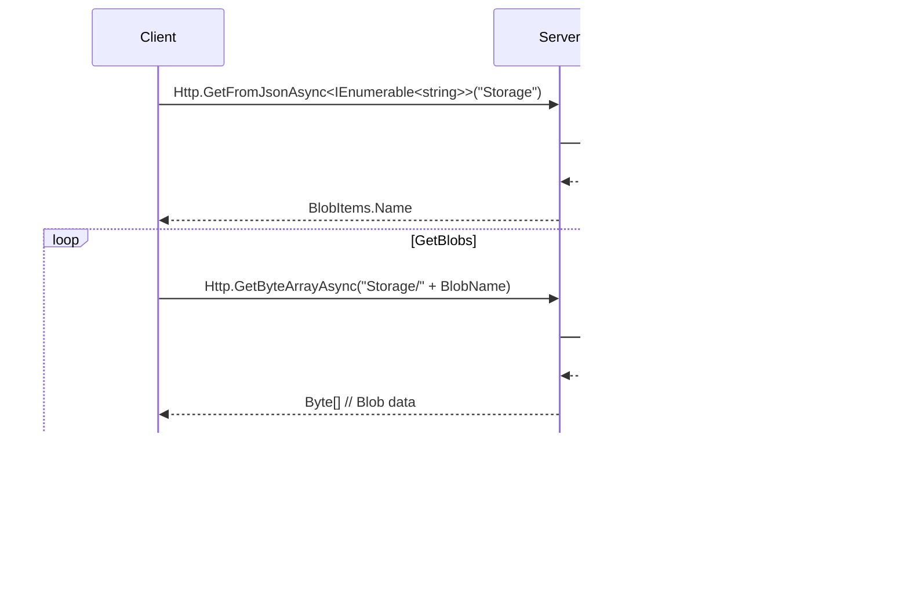
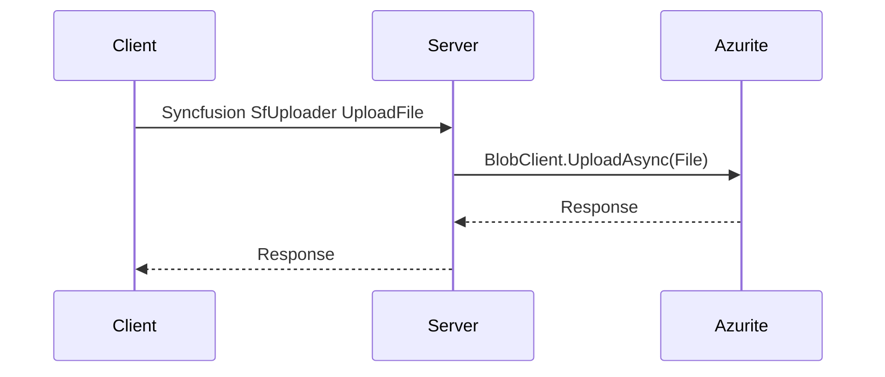
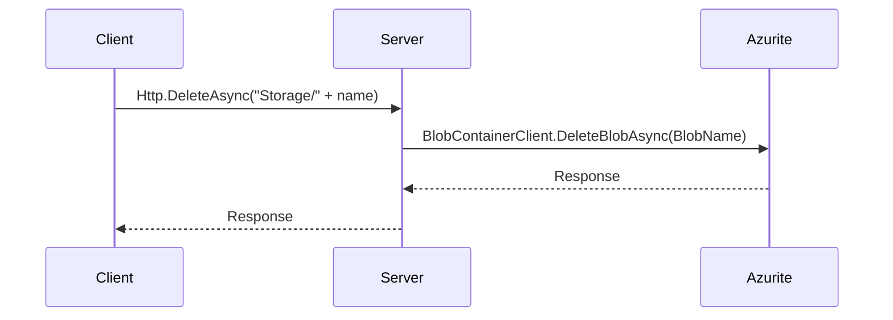

# Upload.razor

## Download Blob

```mermaid
sequenceDiagram
    participant Client
    participant Server
    participant Azurite

    Client->>Server: Http.GetFromJsonAsync<IEnumerable<string>>("Storage")
    Server->>Azurite: BlobClient.GetBlobsAsync()
    Azurite-->>Server: BlobItems
    Server-->>Client: BlobItems.Name
    loop GetBlobs
        Client->>Server: Http.GetByteArrayAsync("Storage/" + BlobName)
        Server->>Azurite: BlobClient.DownloadAsync()
        Azurite-->>Server: BlobDownloadInfo
        Server-->>Client: Byte[] // Blob data
        Client->>Client: Create data URL and set <Image> tag
    end
```

## Upload Blob

```mermaid
sequenceDiagram
    participant Client
    participant Server
    participant Azurite

    Client->>Server: Syncfusion SfUploader UploadFile
    Server->>Azurite: BlobClient.UploadAsync(File)
    Azurite-->>Server: Response
    Server-->>Client: Response
```

## Delete Blob

```mermaid
sequenceDiagram
    participant Client
    participant Server
    participant Azurite

    Client->>Server: Http.DeleteAsync("Storage/" + name)
    Server->>Azurite: BlobContainerClient.DeleteBlobAsync(BlobName)
    Azurite-->>Server: Response
    Server-->>Client: Response
```
