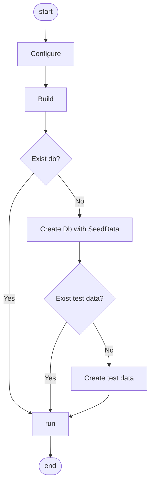

# StartUp

## FlowChart

### Server

```mermaid
graph TD

s([start])-->Configure;
Configure-->Build;
Build-->d1{Exist db?};

d1-- Yes -->run;
d1-- No -->1[Create Db with SeedData];
1 --> d2{Exist test data?}

d2-- Yes -->run;
d2-- No -->2[Create test data];
2 --> run;

run --> e([end]);
```
